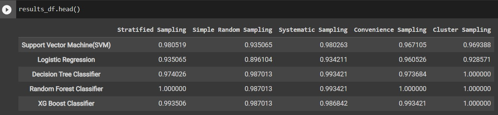

# Comparing Differen Sampling Techniques for 5 Machine Learning Models

## Introduction

# Comparing Sampling Techniques for 5 Machine Learning Models

## Introduction

The aim of this project is to investigate the efficiency of various sampling methods in producing a balanced dataset for a machine learning model. The initial dataset is imbalanced, and as such, random over-sampling and under-sampling techniques are employed to create a balanced dataset. The resulting balanced dataset is then subjected to five distinct sampling techniques, and the resulting samples' accuracies are compared across five different machine learning models.

## Sampling Techniques

The following five sampling techniques were used in this project:

1. **Stratified Sampling:** A sampling technique where the population is divided into subgroups (strata) based on a specific characteristic, and samples are taken from each stratum in proportion to the population.
2. **Simple Random Sampling:** A basic sampling technique where each data point in the dataset has an equal probability of being selected in the sample.

3. **Systematic Sampling:** A sampling technique where every nth element in the population is selected for the sample, with n being a fixed interval.

4. **Convenience Sampling:** A non-probability sampling technique where the sample is chosen based on its convenience to the researcher.

5. **Cluster Sampling:** A sampling technique where the population is divided into clusters, and a sample of clusters is randomly selected. Then, all members of the selected clusters are included in the sample.

## Comparison Table

The accuracy of each sampling method for five distinct machine learning models is displayed in the table below. A balanced version of the original unbalanced dataset was created using random over- and under-sampling approaches and used as the basis for all models.

Based on these results, it can be concluded that best results are obtained when Cluster Sampling is used and Simple random sampling performs the worst on all five models. The other sampling techniques have varying performance depending on the model. The model which gives the best accuracy for all 5 sampling techniques is Random Forest Classifier.

## Conclusion

For this dataset, cluster sampling is advised since it regularly outperforms all other modelling strategies. For certain datasets or models, it could be worthwhile to take into account alternative sampling methods.
